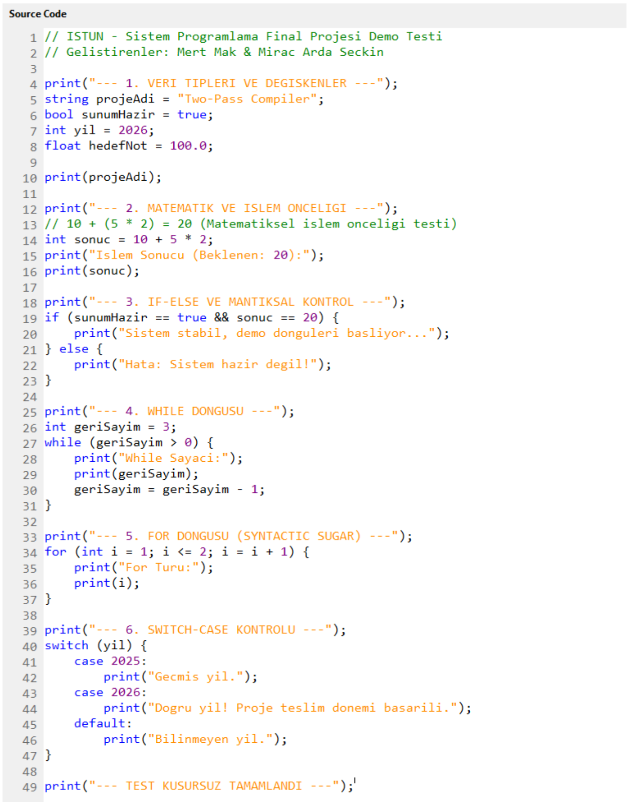
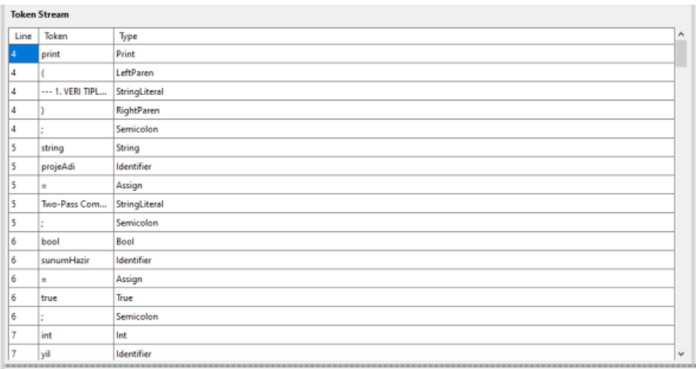
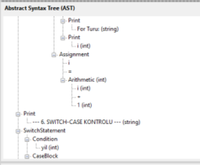
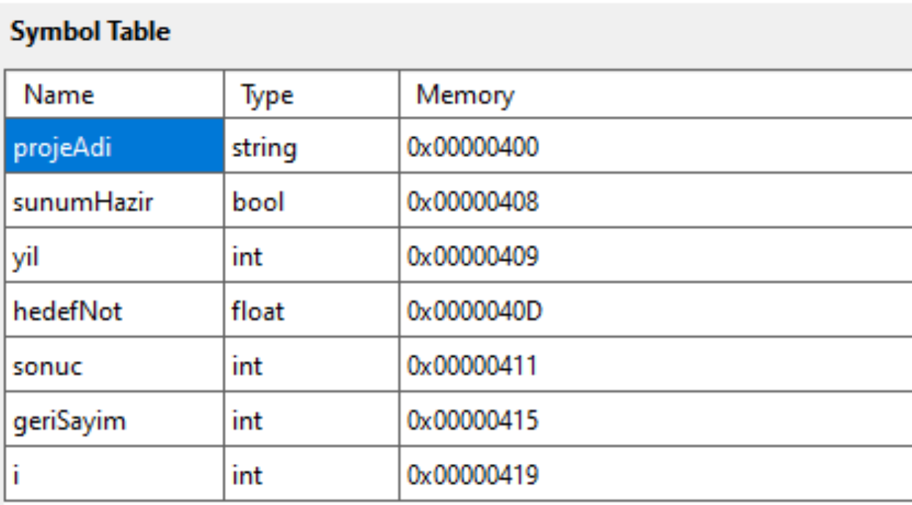
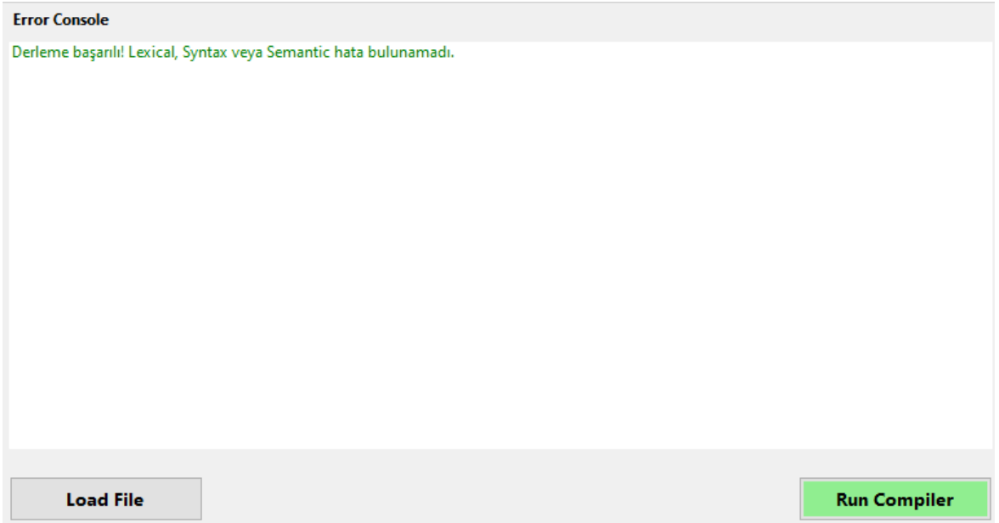

# Design and Implementation of a Two-Pass Compiler & Responsive IDE

An advanced software engineering project featuring a custom **Two-Pass Compiler**, an integrated **Real-Time Interpreter**, and a modern **Responsive IDE** built from scratch. Developed as the Final Project for the System Programming course at Istanbul Health and Technology University (İSTÜN).

---

## 🖥️ Modern Responsive IDE Layout

* **Flexible SplitContainer Architecture:** Eschews legacy static forms for a modern desktop layout segmented across 5 independent reactive tracking zones.
* **Pixel-Perfect Line Numbering:** Features an automated right-aligned numbering component built with a native `PictureBox`.
* **Real-Time Regex Syntax Highlighting:** Integrated custom Regex token parsing that colors key grammar structures instantly on text changes (Keywords ➡️ Blue, Strings ➡️ Orange, Numeric Literals ➡️ Purple, Comments ➡️ Green).

---

## 🚀 System Architecture & Compiler Pipeline

The system is split into two logical and functional core layers to process a custom high-level programming language subset:

### 1. Pass 1: Lexical Analysis (Lexer)

* **Engine Design:** Built as a Deterministic Finite State Machine (DFSM) that character-by-character scans the source code input stream.
* **Tokenization & Filtering:** Converts valid character sequences into strongly typed, meaningful `Token` objects while automatically stripping out whitespaces and inline single-line comments (`//`).
* **Lookahead Mechanism:** Implements a safe `PeekNext()` methodology to accurately differentiate between single and double operators (e.g., `<`, `<=`, `>`, `=>`).

### 2. Pass 2: Syntax & Semantic Analysis (Parser)

* **Parsing Technique:** Utilizes a top-down **Recursive Descent Parsing** strategy matching a strict Backus-Naur Form (BNF) grammar definition.
* **AST Construction:** Generates a structured, hierarchical Abstract Syntax Tree (AST) representing the program's execution logic.
* **Operator Precedence & Syntactic Sugar:** Mathematical precedence is hardcoded into the C# Call Stack natively. Complex loops (like `for`) are silently rewritten into an optimized `WhileStatement` block within the AST layer.

---

## 🛠️ Advanced Compilation Techniques

### Memory & Symbol Table Simulation

* **Hexadecimal Memory Address Simulation:** Implements a realistic 32-bit operating system runtime memory model. 
* **Dynamic Byte Allocation:** Simulates physical RAM consumption by allocating exact byte offsets dynamically (4 bytes for `int`/`float`, 8 bytes for `string`, 1 byte for `bool`). Allocated scopes are rendered inside the UI using professional 8-digit Hexadecimal strings.

### Panic Mode Error Handling

* **Error Synchronization:** Built with a `Synchronize()` recovery method. If a compile error occurs, the parser logs the exception with line data and advances the stream pointer to the next semantic anchor, enabling complete multi-error detection without system crashes.
* **Semantic Integrity:** Enforces **Strong Type Checking** detecting undeclared variables or throwing instant "Type Mismatch" errors when conflicting types interact.

---

## ⚙️ Tech Stack & Development Environment

* **Language:** C#
* **Framework:** .NET 8.0 Runtime
* **UI Technology:** Windows Forms Custom Responsive Engine
* **Development Platform:** Windows OS Deployment Target

---

## 👨‍💻 Team & Responsibility Distribution

* **Mert Mak (230609026)**
  * Lexer FSM and Parser Engine development.
  * Real-time Interpreter execution environment.
  * Semantic Analyzer and 32-bit Hex byte memory allocator logic.

* **Miraç Arda Seçkin (230609034)**
  * Modern Responsive IDE layout and flexible SplitContainer framework.
  * Advanced editor algorithms (Regex syntax highlighting, pixel line numbers).
  * Full-system cross-module integration and UI databinding.
